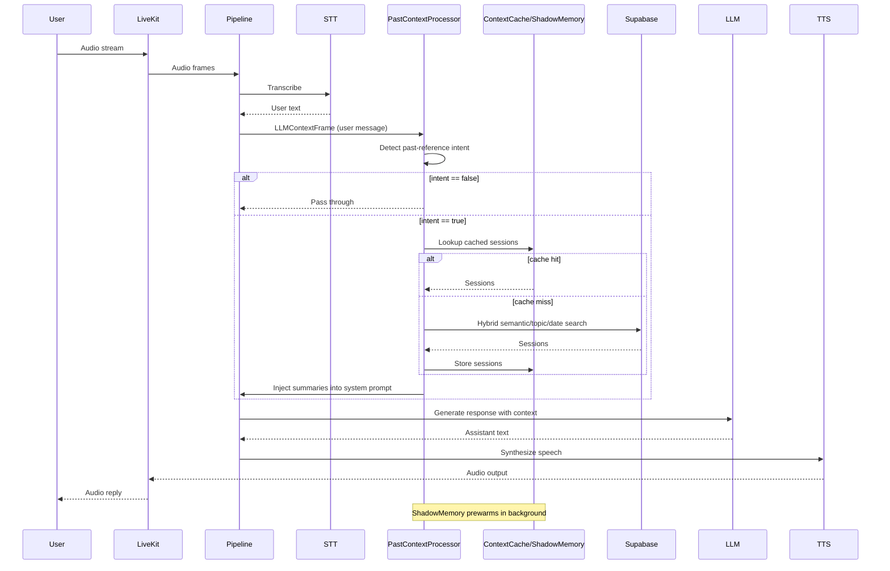

## Context Engineering Walkthrough

This document explains how context is built, injected, and managed in the voice bot,
with rationale for each decision and how the pieces fit together.

### 1) High-level Context Architecture

The system separates "base prompt" from "past-session context" and injects
retrieved context only when needed. This keeps the critical path fast and avoids
spending tokens on irrelevant history.

Key idea: load nothing at startup except a short, stable system prompt, then
add past context on demand.

Primary components:
- `build_base_system_prompt()` builds the minimal, stable system prompt.
- `PastContextProcessor` detects past-reference intent and performs retrieval.
- `ShadowMemory` pre-warms common context in the background.
- `ContextCache` caches results and embeddings to avoid repeated DB calls.
- `inject_past_context()` appends retrieved summaries into the system prompt.
- `ChunkQuestionIndex` stores LLM-generated questions for chunk-level recall.
- `ConversationMemory` summarizes long conversations mid-session.

### 2) Startup Flow and Prompt Initialization

`backend/bot/main.py` sets up a pipeline that starts quickly:
- The bot creates a base system prompt via `build_base_system_prompt()`.
- It intentionally skips past context at startup for faster initialization.
- It builds a `OpenAILLMContext` with only the base prompt.

Why this approach?
- Startup latency matters in a voice system. Loading large context blocks
  on every session adds delay and wastes tokens when users never ask about
  history.
- A short prompt helps maintain a predictable instruction hierarchy.

### 3) Dynamic Context Retrieval (On-demand Past References)

`PastContextProcessor` runs immediately before the LLM in the pipeline.
It inspects the last user message and decides if history is needed.

Decision flow:
1) Detect past-reference intent (`detect_past_reference_intent`).
2) Check cache for prior results (`ContextCache`).
3) If cache miss, run retrieval:
   - chunk-question semantic search (preferred recall path)
   - chunk-question topic search
4) Inject chunk text into the system prompt (`inject_chunk_context`).
5) Session-summary fallback is optional and disabled by default.

Why run this processor before the LLM?
- This prevents the race condition where the LLM responds before
  the context is injected.
- It ensures past context is always present by the time the model runs.

### 4) Intent Detection: Regex First, Embeddings Second

`detect_past_reference_intent()` uses a hybrid strategy:
- Regex fast path (most common patterns).
- Embedding similarity fallback for paraphrases.

Why regex before embeddings?
- 95% of queries are fast keyword/regex matches.
- Embeddings are slower and unnecessary for most cases.
- Embeddings handle edge cases without making every query expensive.

### 5) Query Understanding and Expansion

`expand_query_for_search()` rewrites short or conversational queries:
- Adds context for short terms (e.g., "sleep" → "discussion about sleep").
- Adds domain synonyms (sleep/rest/bedtime).
- Extracts topics from verbose text to focus embeddings on relevant words.

Why expand queries?
- Short queries produce weak embeddings.
- Expanded phrases improve semantic retrieval accuracy.

### 6) Retrieval Strategies and Why They Exist

The system chooses a strategy based on intent type:
- **Date range**: precise filters when user says "last week".
- **Chunk-question semantic**: highest recall for paraphrases using LLM-generated questions.
- **Chunk-question topic**: fast topic filters when semantic is off.
- **Topic**: filter by extracted topics (session summaries).
- **Semantic/general**: hybrid semantic + keyword search on session summaries (optional).
- **Fallback**: recent sessions if user asked for history but nothing matched.

Why hybrid search (semantic + keyword + metadata)?
- Semantic embeddings catch paraphrases.
- Keyword search helps with explicit terms.
- Metadata filters reduce noise and improve relevance.

### 7) Shadow Memory (Background Pre-warming)

`ShadowMemory.prewarm()` runs asynchronously after session start:
- Fetches recent session summaries.
- Caches common queries (last session, recent sessions).
- Preloads embeddings in a local cache for instant similarity search.
- Optionally injects recent context into the system prompt.

Why prewarm in background?
- Keeps the critical path (first response) fast.
- Still enables fast replies if the user asks about history early.

### 8) Context Injection Strategy

`inject_past_context()` appends the retrieved summaries into the *existing
system prompt* rather than adding new system messages mid-conversation.

Why append to the existing system message?
- Many LLMs prioritize the earliest system instruction.
- Adding separate system messages mid-stream can be ignored or weakened.
- Appending preserves instruction hierarchy and reduces ambiguity.

Token safety:
- Injection is capped (approx. 2000 tokens).
- Summaries are truncated to avoid exceeding prompt limits.

### 9) Cache Design

`ContextCache` caches:
- Query results (short TTL to keep data fresh).
- Embeddings (longer TTL for efficiency).

Why in-memory cache?
- Most users repeat similar history queries.
- Avoids repeated DB calls in a voice setting.
- Keeps the critical path deterministic.

### 10) Session Summaries and Long-Session Compression

Two separate memory tracks:
1) **Past session summaries** in Supabase for cross-session recall.
2) **ConversationMemory** for long sessions (within-session compression).

Why split these?
- Past sessions are durable, cross-session memory.
- Conversation memory compresses live context to avoid token overflows.

### 11) Why X Over Y (Design Rationale)

- **Dynamic context vs static prompt stuffing**
  - Dynamic avoids wasted tokens and keeps responses fast.
- **Regex intent detection vs always-embed**
  - Regex is cheap and reliable for most queries; embeddings handle edge cases.
- **Hybrid search vs pure vector search**
  - Hybrid improves precision and reduces false positives.
- **Append to existing system prompt vs new system message**
  - Maintains instruction hierarchy; new system messages can be de-prioritized.
- **Background pre-warm vs blocking startup**
  - Keeps the first interaction fast while still warming memory.
- **In-memory cache vs persistent cache**
  - Low-latency and simpler; persistent cache adds complexity for limited gain.

### 12) Sequence Diagram

### 13) Code Map (Key Files)

- `backend/bot/main.py`: pipeline assembly and base prompt setup
- `backend/bot/services/prompt_builder.py`: base prompt construction
- `backend/bot/services/past_context_processor.py`: dynamic context retrieval
- `backend/bot/services/context_injector.py`: prompt injection logic
- `backend/bot/services/context_cache.py`: cache and embeddings storage
- `backend/bot/services/intent_detector.py`: hybrid intent detection
- `backend/bot/services/query_understanding.py`: query expansion
- `backend/bot/services/shadow_memory.py`: pre-warming and background caching
- `backend/bot/services/context_manager.py`: token limits and truncation
- `backend/bot/services/database_service.py`: Supabase session search
- `backend/bot/handlers/events.py`: session summary, memory compression, metrics

