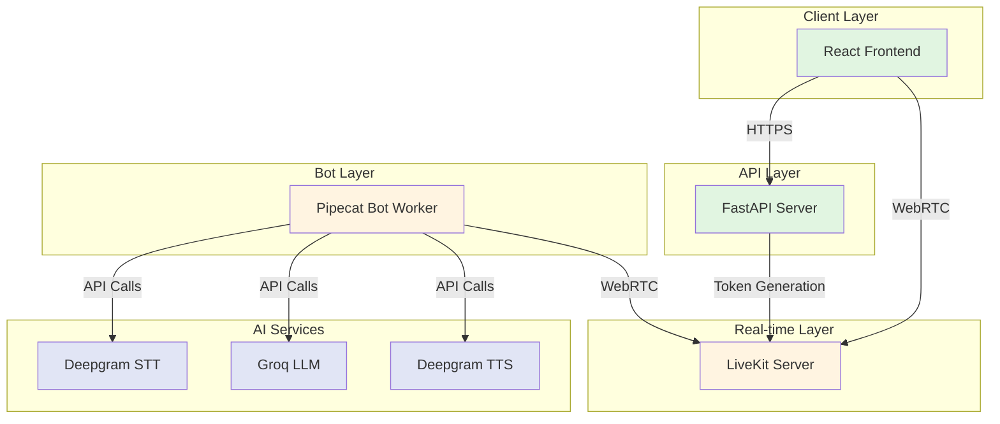
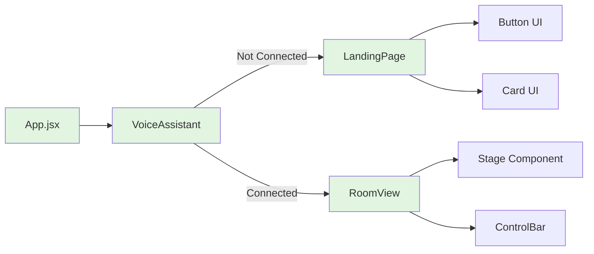
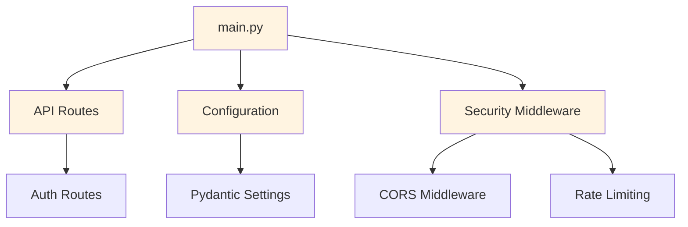
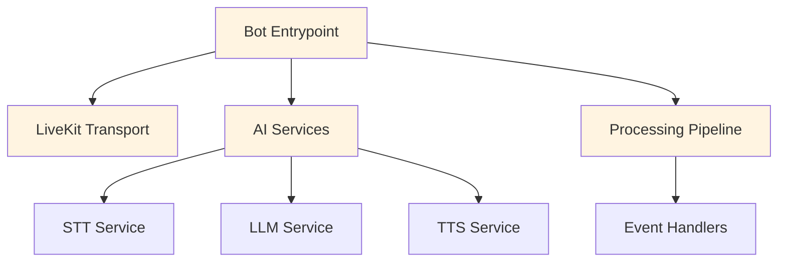
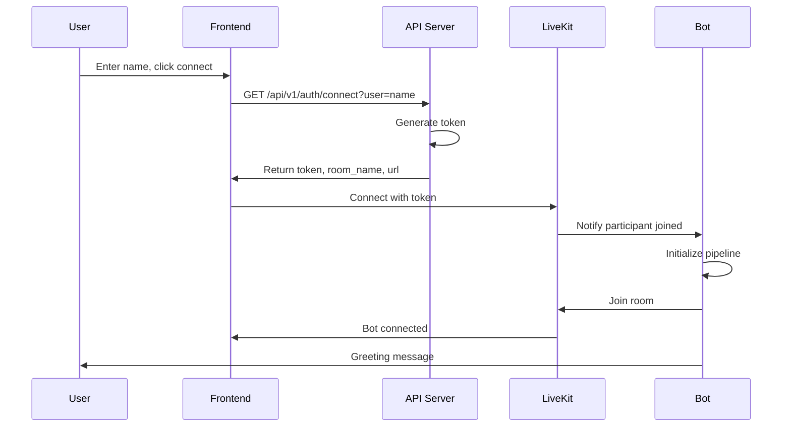
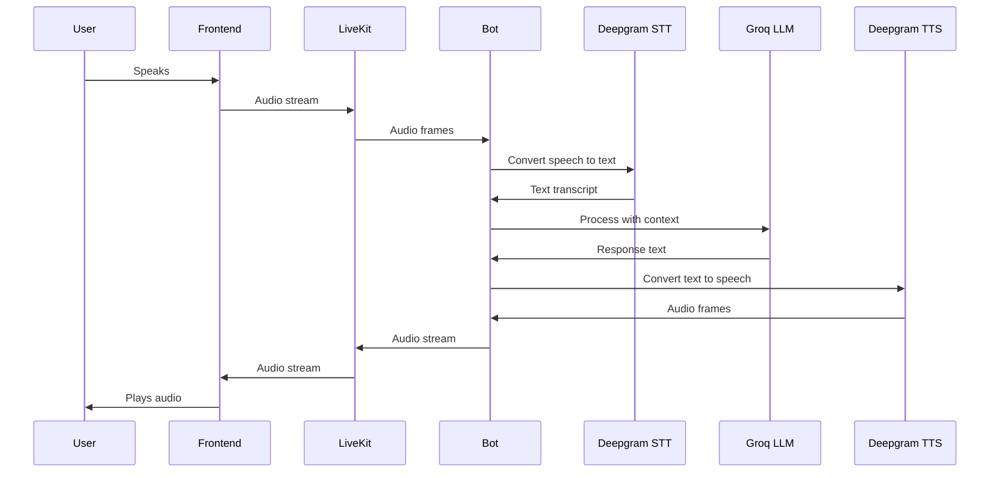
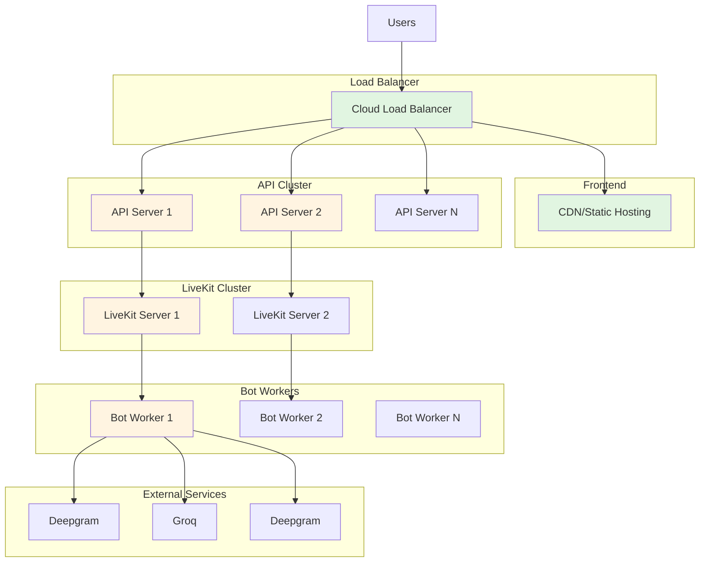
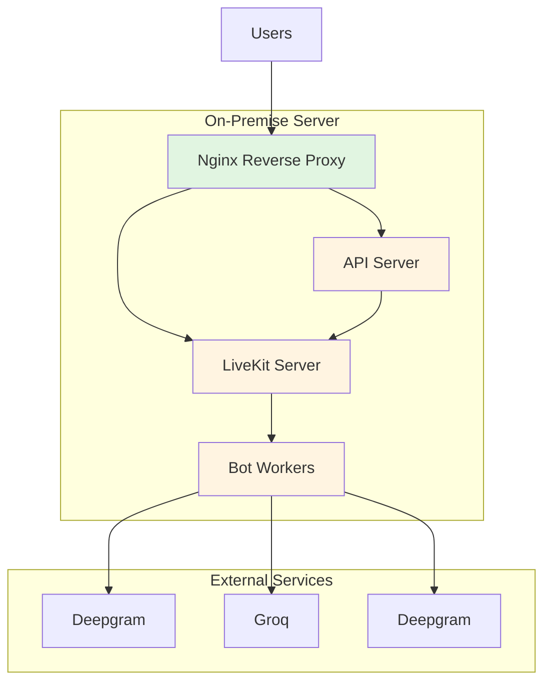

# High-Level Design (HLD)
## Woka Wellness Voice AI Assistant

**Version:** 1.0.0  
**Date:** 2024

---

## 1. System Overview

Woka Wellness is a real-time voice AI coaching application that enables users to have natural voice conversations with an AI wellness coach. The system uses WebRTC for real-time audio communication and integrates multiple AI services for speech processing and generation.

### 1.1 System Architecture



---

## 2. Component Architecture

### 2.1 Frontend Components



### 2.2 Backend Components



### 2.3 Bot Components



---

## 3. Data Flow

### 3.1 User Connection Flow



### 3.2 Voice Interaction Flow



---

## 4. Technology Stack

### 4.1 Frontend
- **Framework:** React 18
- **Build Tool:** Vite
- **Styling:** Tailwind CSS
- **Real-time:** LiveKit React Components
- **Language:** JavaScript (ES6+)

### 4.2 Backend
- **Framework:** FastAPI
- **Language:** Python 3.10+
- **Configuration:** Pydantic Settings
- **Logging:** Python logging
- **Server:** Uvicorn

### 4.3 Bot
- **Framework:** Pipecat AI
- **Transport:** LiveKit Agents
- **VAD:** Silero VAD
- **Language:** Python 3.10+

### 4.4 Infrastructure
- **Real-time:** LiveKit Server
- **STT:** Deepgram API
- **LLM:** Groq API
- **TTS:** Deepgram API (Aura voices)

---

## 5. Deployment Architecture

### 5.1 Cloud Deployment



### 5.2 On-Premise Deployment



---

## 6. Security Architecture

### 6.1 Security Layers

1. **Network Security**
   - HTTPS/TLS for all communications
   - CORS configuration
   - Rate limiting

2. **Authentication**
   - JWT tokens for LiveKit access
   - Token expiration
   - Secure token generation

3. **Data Security**
   - No persistent storage of voice data
   - Environment variable management
   - Secrets management

4. **Application Security**
   - Input validation
   - Error handling without exposing internals
   - Security headers

---

## 7. Scalability Considerations

### 7.1 Horizontal Scaling
- API servers can be scaled independently
- Bot workers can be scaled based on load
- LiveKit supports clustering

### 7.2 Performance Optimization
- Pre-warmed bot processes
- Connection pooling
- Efficient pipeline processing

### 7.3 Resource Management
- Process limits per worker
- Memory management
- CPU usage monitoring

---

## 8. Monitoring and Observability

### 8.1 Metrics
- Request rate
- Response times
- Error rates
- Active sessions
- Bot worker load

### 8.2 Logging
- Structured logging
- Log levels (DEBUG, INFO, WARNING, ERROR)
- Request/response logging

### 8.3 Health Checks
- API health endpoint
- Bot worker health
- Service availability

---

## 9. Error Handling Strategy

### 9.1 Error Types
- **Client Errors:** Validation, authentication
- **Server Errors:** Internal errors, service unavailability
- **Network Errors:** Connection failures, timeouts

### 9.2 Error Handling Flow
1. Error occurs
2. Log error with context
3. Return appropriate HTTP status
4. Provide user-friendly message
5. Monitor and alert

---

## 10. Session History and Agentic Memory

### 10.1 Session Storage
- **Database:** Supabase (PostgreSQL) for session summaries
- **Storage:** In-memory transcript storage during sessions
- **Persistence:** Summaries saved on session end (disconnect or call end)
- **Normalization:** User names normalized (lowercase) for consistent lookups

### 10.2 Summary Generation
- **Method:** LLM-based summarization using Groq
- **Content:** Main topics, user goals, key advice, progress/plans
- **Timing:** Generated when session ends (≥30 seconds, ≥2 messages)
- **Fallback:** Basic summary if LLM fails

### 10.3 Agentic Memory
- **Retrieval:** Fetches last 10 past sessions on user join
- **Integration:** Past session summaries included in LLM system prompt
- **Continuity:** Bot references past conversations naturally
- **Privacy:** User name normalization ensures consistent history

### 10.4 Data Flow
```
User Session → Transcript (RAM) → Summary (LLM) → Supabase → Next Session Context
```

---

## 11. Future Enhancements

### 11.1 Architecture Improvements
- Message queue for async processing
- Caching layer for session summaries
- CDN for static assets
- Real-time analytics

### 11.2 Feature Additions
- User accounts and authentication
- Analytics dashboard
- Admin panel
- Session export/download
- Multi-language support

