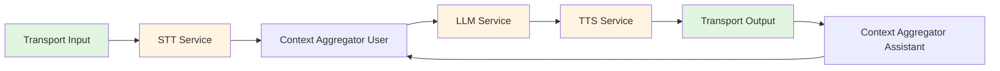
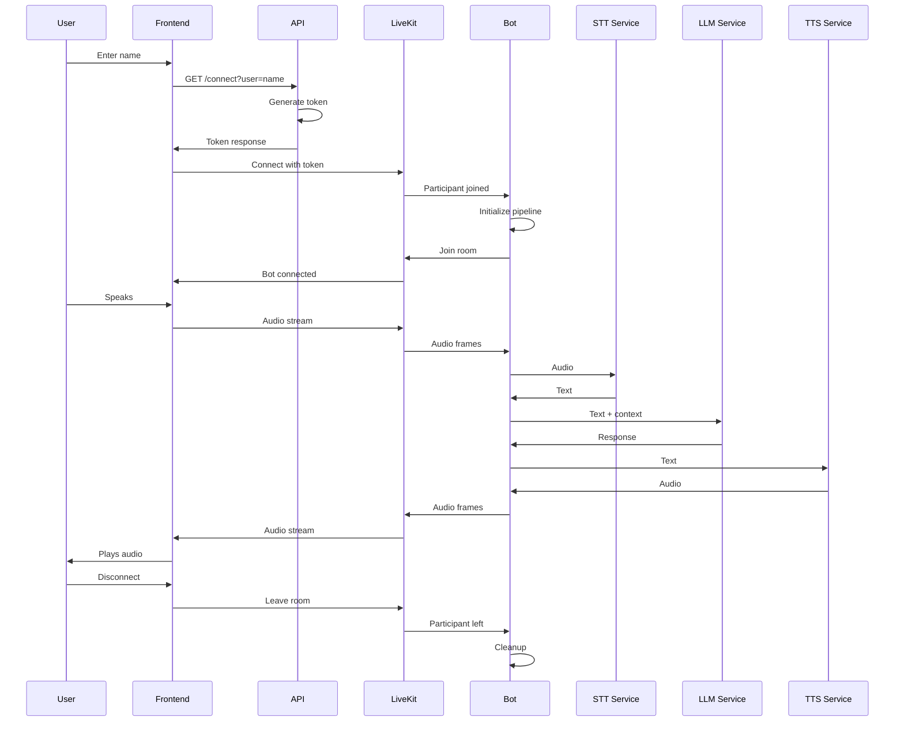
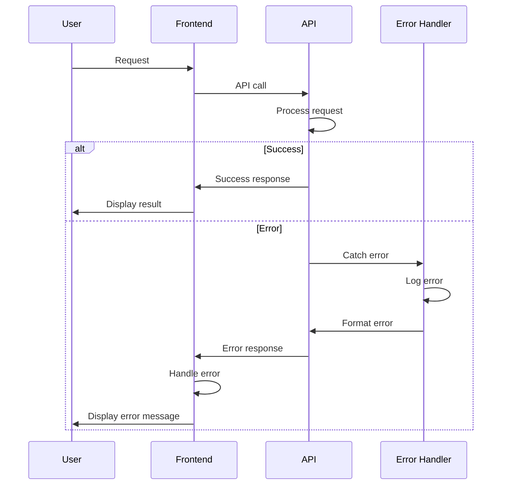

# Low-Level Design (LLD)
## Woka Wellness Voice AI Assistant

**Version:** 1.0.0  
**Date:** 2024

---

## 1. Component Details

### 1.1 Backend API Module

#### 1.1.1 Configuration Module (`app/core/config.py`)

**Class:** `Settings`

**Purpose:** Centralized configuration management using Pydantic Settings.

**Attributes:**
- `APP_NAME`: Application name
- `APP_VERSION`: Application version
- `ENVIRONMENT`: Environment (development/staging/production)
- `DEBUG`: Debug mode flag
- `API_HOST`: API server host
- `API_PORT`: API server port
- `CORS_ORIGINS`: Allowed CORS origins
- `LIVEKIT_API_KEY`: LiveKit API key
- `LIVEKIT_API_SECRET`: LiveKit API secret
- `LIVEKIT_URL`: LiveKit WebSocket URL
- `GROQ_API_KEY`: Groq API key
- `DEEPGRAM_API_KEY`: Deepgram API key
- `DEEPGRAM_TTS_VOICE`: Deepgram TTS voice (default: `aura-2-helena-en`)
- `SUPABASE_URL`: Supabase project URL (optional)
- `SUPABASE_KEY`: Supabase API key (optional)
- `SUPABASE_ENABLED`: Enable Supabase (default: `false`)
- `LLM_MODEL`: LLM model name
- `BOT_NAME`: Bot display name
- `VAD_THRESHOLD`: Voice activity detection threshold
- `NUM_IDLE_PROCESSES`: Number of pre-warmed processes
- `RATE_LIMIT_ENABLED`: Rate limiting flag
- `RATE_LIMIT_REQUESTS`: Requests per window
- `RATE_LIMIT_WINDOW`: Rate limit window in seconds

**Methods:**
- `is_production`: Property to check if in production
- `is_development`: Property to check if in development

#### 1.1.2 Logging Module (`app/core/logging.py`)

**Functions:**
- `setup_logging(log_level)`: Configure application logging
- `get_logger(name)`: Get logger instance

**Configuration:**
- Log format: Timestamp, name, level, message
- Handlers: Console output
- Logger levels: Configurable per module

#### 1.1.3 Security Module (`app/core/security.py`)

**Classes:**
- `SecurityHeadersMiddleware`: Adds security headers
- `RateLimitMiddleware`: Implements rate limiting

**Rate Limiting Algorithm:**
- Simple in-memory counter
- Key: `{client_ip}:{time_window}`
- Window-based sliding window
- Configurable limits

#### 1.1.4 Auth Routes (`app/api/routes/auth.py`)

**Endpoint:** `GET /api/v1/auth/connect`

**Parameters:**
- `user` (query, required): User display name

**Response:**
```json
{
  "room_name": "room_12345",
  "token": "eyJ...",
  "url": "ws://127.0.0.1:7880"
}
```

**Process:**
1. Validate user name
2. Generate unique room name
3. Create LiveKit access token
4. Add user metadata to token
5. Return token and room info

### 1.2 Bot Module

#### 1.2.1 Bot Entrypoint (`bot/main.py`)

**Functions:**
- `prewarm(proc)`: Pre-warm bot processes
- `entrypoint(ctx)`: Main bot entrypoint
- `compute_load(worker)`: Compute worker load

**Entrypoint Flow:**
1. Get pre-warmed VAD analyzer
2. Connect to LiveKit room
3. Extract user metadata
4. Generate bot token
5. Create LiveKit transport
6. Initialize AI services (STT, LLM, TTS)
7. Create system prompt with user name
8. Build processing pipeline
9. Setup event handlers
10. Run pipeline

#### 1.2.2 Service Wrappers

**STT Service (`bot/services/stt_service.py`)**
- Function: `create_stt_service()`
- Returns: `DeepgramSTTService` instance
- Configuration: API key from settings

**LLM Service (`bot/services/llm_service.py`)**
- Function: `create_llm_service()`
- Returns: `GroqLLMService` instance
- Configuration: API key and model from settings

**TTS Service (`bot/services/tts_service.py`)**
- Function: `create_tts_service()`
- Returns: `DeepgramTTSService` instance
- Configuration: API key and voice from settings (default: `aura-2-helena-en`)

**Summary Service (`bot/services/summary_service.py`)**
- Function: `generate_session_summary(transcript, user_name, duration_seconds)`
- Purpose: Generate LLM-based session summaries
- Method: Uses Groq LLM API directly for summarization
- Returns: Detailed summary text (3-5 sentences)
- Fallback: Basic summary if LLM fails

**Transcript Storage (`bot/services/transcript_storage.py`)**
- Class: `TranscriptStorage`
- Purpose: In-memory storage of session transcripts
- Methods: `add_message()`, `get_transcript()`, `clear_session()`
- Storage: RAM-based, cleared after saving to database

#### 1.2.3 Event Handlers (`bot/handlers/events.py`)

**Function:** `setup_event_handlers(transport, task)`

**Events:**
- `on_participant_joined`: Greet user
- `on_participant_left`: Save session summary, cleanup and cancel task
- `on_call_ended`: Save session summary, cancel task

**Session Saving:**
- Triggered on disconnect or call end
- Minimum duration: 30 seconds
- Minimum messages: 2 (user + assistant)
- Generates LLM summary and saves to Supabase
- Prevents duplicate saves (checks existing sessions)

### 1.3 Frontend Components

#### 1.3.1 VoiceAssistant Component

**Location:** `frontend/src/components/VoiceAssistant.jsx`

**State:**
- `roomData`: Connection data (token, room_name, url)
- `isLoading`: Loading state

**Methods:**
- `handleConnect(userName)`: Connect to session
- `handleDisconnect()`: Disconnect from session

**Lifecycle:**
- Health check on mount
- Render LandingPage or RoomView based on state

#### 1.3.2 LandingPage Component

**Location:** `frontend/src/components/LandingPage.jsx`

**State:**
- `userName`: User input
- `isConnecting`: Connection state
- `error`: Error message

**Methods:**
- `handleSubmit(e)`: Submit form and connect

#### 1.3.3 RoomView Component

**Location:** `frontend/src/components/RoomView.jsx`

**Sub-components:**
- `Stage`: Displays participants

**Props:**
- `roomData`: Connection data
- `onDisconnect`: Disconnect callback

---

## 2. Processing Pipeline

### 2.1 Pipeline Architecture



### 2.2 Frame Flow

1. **Audio Input Frame** → Transport receives audio
2. **Audio Raw Frame** → STT processes audio
3. **Text Frame** → STT outputs text
4. **LLM Context Frame** → Context aggregator adds to context
5. **LLM Request** → LLM processes request
6. **LLM Response Frame** → LLM outputs response
7. **Text Frame** → TTS receives text
8. **Audio Raw Frame** → TTS generates audio
9. **Audio Output Frame** → Transport sends audio

---

## 3. Sequence Diagrams

### 3.1 Complete User Session Flow



### 3.2 Error Handling Flow



---

## 4. Data Models

### 4.1 API Request/Response Models

**Token Request:**
```python
user: str (query parameter, required, min_length=1, max_length=100)
```

**Token Response:**
```python
class TokenResponse:
    room_name: str
    token: str
    url: str
```

**Health Check Response:**
```python
{
    "status": "healthy",
    "app": "Woka Wellness Voice Assistant",
    "version": "1.0.0",
    "environment": "development"
}
```

### 4.2 Bot Configuration

**System Prompt Template:**
```
## ROLE
You are "{BOT_NAME}," an empathetic, professional, and motivational Wellness Coach.

## CORE PRINCIPLES
1. Scope of Practice: nutrition, exercise, sleep, stress management
2. Safety First: NOT a medical professional
3. Guardrails: Refuse medical diagnoses, prescriptions
4. Ethics: Never encourage harmful activities

## STYLE & TONE
- Grounded, encouraging, clear
- Concise responses
- Warm greetings
```

---

## 5. Error Handling

### 5.1 Exception Hierarchy

```python
AppException (base)
├── ConfigurationError
├── AuthenticationError
├── ValidationError
└── ServiceError
```

### 5.2 Error Response Format

```json
{
    "error": "Error message",
    "details": {
        "field": "additional info"
    }
}
```

### 5.3 Error Codes

- `400`: Bad Request (ValidationError)
- `401`: Unauthorized (AuthenticationError)
- `429`: Too Many Requests (RateLimitMiddleware)
- `500`: Internal Server Error (AppException)
- `503`: Service Unavailable (ServiceError)

---

## 6. Security Implementation

### 6.1 Token Generation

```python
token = api.AccessToken(api_key, api_secret)
    .with_identity(user)
    .with_grants(VideoGrants(room_join=True, room=room_name))
    .with_metadata(json.dumps({"user_name": user}))
```

### 6.2 CORS Configuration

```python
CORS_ORIGINS: List[str] = [
    "http://localhost:5173",
    "http://localhost:3000"
]
```

### 6.3 Rate Limiting

- Algorithm: Sliding window
- Storage: In-memory dictionary
- Key: `{ip}:{time_window}`
- Default: 100 requests per 60 seconds

---

## 7. Performance Optimizations

### 7.1 Bot Pre-warming

- Pre-load VAD model in `prewarm()`
- Store in `proc.userdata`
- Reuse across jobs

### 7.2 Pipeline Configuration

- `allow_interruptions=True`: Enable user interruptions
- VAD threshold: 0.5 (configurable)
- Audio enabled: Input and output

### 7.3 Worker Configuration

- `num_idle_processes=3`: Pre-warmed processes
- Load function: `min(active_jobs / 5, 1.0)`

---

## 8. Testing Strategy

### 8.1 Unit Tests

**Backend:**
- Configuration loading
- Token generation
- Error handling
- Rate limiting

**Bot:**
- Service initialization
- Pipeline construction
- Event handlers

### 8.2 Integration Tests

- API endpoints
- Bot pipeline
- End-to-end flow

### 8.3 Test Structure

```
backend/tests/
├── test_api.py
└── test_bot.py
```

---

## 9. Deployment Configuration

### 9.1 Environment Variables

**Required:**
- `LIVEKIT_API_KEY`
- `LIVEKIT_API_SECRET`
- `GROQ_API_KEY` (for LLM)
- `DEEPGRAM_API_KEY` (for STT & TTS)

**Optional:**
- `DEEPGRAM_TTS_VOICE` (default: `aura-2-helena-en`)
- `SUPABASE_URL` (for session history)
- `SUPABASE_KEY` (for session history)
- `SUPABASE_ENABLED` (default: `false`)
- `ENVIRONMENT` (default: development)
- `DEBUG` (default: False)
- `API_PORT` (default: 8000)
- `CORS_ORIGINS` (default: localhost)
- `BOT_NAME` (default: `Woka`)
- `LLM_MODEL` (default: `llama-3.3-70b-versatile`)

### 9.2 Docker Configuration

**Backend Dockerfile:**
- Base: Python 3.10
- Install dependencies
- Copy application code
- Expose port 8000

**Frontend Dockerfile:**
- Base: Node.js
- Build application
- Serve with nginx

---

## 10. Monitoring and Logging

### 10.1 Log Levels

- `DEBUG`: Detailed information
- `INFO`: General information
- `WARNING`: Warning messages
- `ERROR`: Error messages
- `CRITICAL`: Critical errors

### 10.2 Log Format

```
{timestamp} - {name} - {level} - {message}
```

### 10.3 Key Log Points

- Application startup
- Token generation
- Bot connection
- Service initialization
- Errors and exceptions

