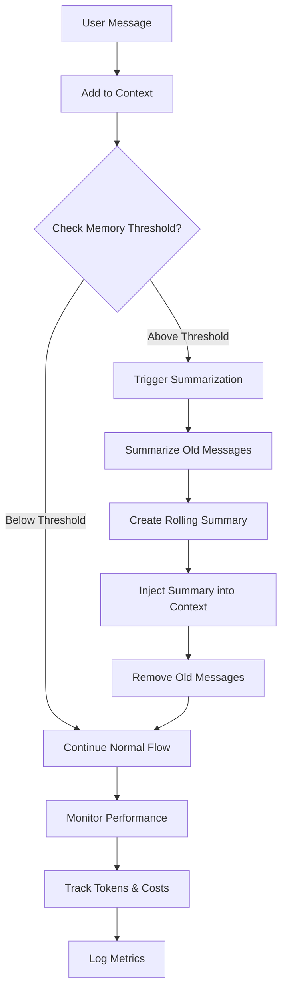

# Memory Management & Performance Optimization Plan

## Current State Analysis

### What We Have:
✅ **Context Management**: System prompts, past session summaries, dynamic injection  
✅ **Session Storage**: Automatic summarization and Supabase storage  
✅ **Dynamic Queries**: Semantic search for past references  
✅ **Basic Monitoring**: Context size validation and logging

### What's Missing:
❌ **In-Session Memory Management**: No handling for long conversations (100+ messages)  
❌ **Progressive Summarization**: Old messages never get summarized during conversation  
❌ **Context Window Monitoring**: No active monitoring of conversation history growth  
❌ **Smart Truncation**: Framework handles it, but we don't optimize proactively  
❌ **Performance Metrics**: No tracking of token usage, costs, or response times  
❌ **Memory Compression**: No compression of old context to save tokens

## Proposed Improvements

### Phase 1: Conversation Memory Management

**Problem**: Long conversations (100+ messages) can approach context limits, but we rely entirely on Pipecat's framework without proactive management.

**Solution**: Implement intelligent conversation memory management with progressive summarization.

**Key Features**:
1. **Message Window Management**
   - Monitor conversation length (message count, token usage)
   - Set thresholds for when to trigger summarization (e.g., every 50 messages)
   - Keep recent messages (last 20-30) in full detail
   - Summarize older messages into compressed context

2. **Progressive Summarization**
   - Periodically summarize older conversation segments
   - Create "rolling summaries" that capture earlier context
   - Inject summaries as system messages to maintain continuity
   - Balance between detail and token efficiency

3. **Context Window Monitoring**
   - Real-time tracking of total context size (system + past + conversation)
   - Alerts when approaching limits (80%, 90%, 95%)
   - Automatic compression when thresholds are reached

### Phase 2: Performance Optimization

**Problem**: No visibility into token usage, costs, or performance bottlenecks.

**Solution**: Add comprehensive performance monitoring and optimization.

**Key Features**:
1. **Token Usage Tracking**
   - Track tokens per request (input/output)
   - Calculate costs per session
   - Monitor trends over time
   - Alert on unusual spikes

2. **Response Time Optimization**
   - Monitor LLM response times
   - Track embedding generation latency
   - Identify slow queries (Supabase, API calls)
   - Cache frequently accessed data

3. **Cost Optimization**
   - Estimate costs per conversation
   - Optimize embedding generation (batch, cache)
   - Reduce unnecessary API calls
   - Smart caching strategies

### Phase 3: Advanced Memory Features

**Future Enhancements**:
1. **User Memory Profiles**: Store user preferences, goals, constraints separately
2. **Topic-Based Memory**: Organize memory by wellness topics (sleep, nutrition, etc.)
3. **Memory Importance Scoring**: Prioritize important information to keep in context
4. **Adaptive Summarization**: Adjust summarization frequency based on conversation pace

## Implementation Strategy

### Priority 1: Conversation Memory Management (High Impact)

**Files to Create/Modify**:
- `backend/bot/services/conversation_memory.py` (NEW) - Core memory management
- `backend/bot/services/memory_compressor.py` (NEW) - Summarization logic
- `backend/bot/handlers/events.py` (MODIFY) - Add memory monitoring hooks
- `backend/bot/main.py` (MODIFY) - Integrate memory manager

**Key Functions**:
- `monitor_conversation_memory(context)` - Track conversation growth
- `should_summarize(messages, threshold)` - Decide when to summarize
- `summarize_conversation_segment(messages)` - Compress old messages
- `inject_summary(context, summary)` - Add summary to context

### Priority 2: Performance Monitoring (Medium Impact)

**Files to Create/Modify**:
- `backend/bot/services/performance_monitor.py` (NEW) - Metrics collection
- `backend/bot/services/cost_tracker.py` (NEW) - Cost calculation
- `backend/app/core/config.py` (MODIFY) - Add performance config

**Key Metrics**:
- Token usage per request
- API call latency
- Context size over time
- Cost per session

### Priority 3: Smart Caching & Optimization (Medium Impact)

**Enhancements**:
- Embedding cache (avoid regenerating same embeddings)
- Query result caching (semantic search results)
- Batch embedding generation
- Lazy loading of past sessions

## Architecture Diagram



## Success Metrics

- **Memory Efficiency**: Reduce token usage by 20-30% for long conversations
- **Performance**: Maintain <2s response time even with 100+ message conversations
- **Cost Reduction**: 15-25% reduction in API costs through optimization
- **Reliability**: Zero context overflow errors
- **Quality**: Maintain conversation quality despite summarization

## Configuration Options

```python
# Memory Management
ENABLE_CONVERSATION_MEMORY: bool = True
MEMORY_SUMMARIZATION_THRESHOLD: int = 50  # messages
MEMORY_KEEP_RECENT: int = 30  # Keep last N messages in full
MEMORY_SUMMARY_FREQUENCY: int = 25  # Summarize every N messages
CONTEXT_WARNING_THRESHOLD: float = 0.8  # 80% of context window

# Performance Monitoring
ENABLE_PERFORMANCE_MONITORING: bool = True
TRACK_TOKEN_USAGE: bool = True
TRACK_COSTS: bool = True
PERFORMANCE_LOG_INTERVAL: int = 10  # Log every N requests
```

## Risk Assessment

**Low Risk**:
- Performance monitoring (read-only, no behavior changes)
- Logging enhancements

**Medium Risk**:
- Conversation summarization (could lose context if done incorrectly)
- Memory compression (needs careful testing)

**Mitigation**:
- Start with monitoring only
- Add summarization as opt-in feature flag
- Extensive testing with long conversations
- Fallback to framework's default behavior if issues occur

## Next Steps Decision

Would you like to:
1. **Start with monitoring** (safest, immediate value)
2. **Implement full memory management** (higher impact, more complex)
3. **Hybrid approach** (monitoring first, then memory management)


