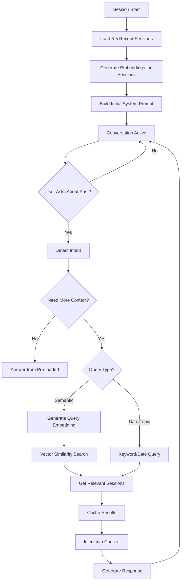

# Production-Ready Past Reference System

## Overview

Transform the current static context loading into a hybrid system that combines pre-loaded recent sessions with dynamic runtime querying. This enables the bot to reliably answer questions about any past session, not just the most recent ones.

## Architecture



## Implementation Plan

### Phase 1: Intent Detection System

**File**: `backend/bot/services/intent_detector.py` (NEW)

Create an intent detection service that identifies when users ask about past conversations:

- **Function**: `detect_past_reference_intent(user_message: str) -> Optional[PastReferenceIntent]`
- **Detects**:
  - Questions about past sessions ("What did we discuss last time?", "What was my goal?")
  - Date-specific queries ("What did we talk about on [date]?")
  - Topic-specific queries ("What did we discuss about sleep?")
  - Progress queries ("What progress have I made?")
- **Returns**: Intent object with type, date range, topics, etc.
- **Implementation**: Use keyword matching + simple LLM classification (lightweight)

### Phase 2: Embedding Generation & Storage

**File**: `backend/bot/services/embedding_service.py` (NEW)

Create embedding service for semantic search:

- **Function**: `generate_embedding(text: str) -> List[float]`
- **Model**: Use OpenAI embeddings API or local model (e.g., `sentence-transformers`)
- **Purpose**: Generate vector embeddings for session summaries
- **Storage**: Embeddings stored in database alongside summaries

**File**: `docs/SUPABASE_SCHEMA.sql` (MODIFY)

Add vector support to database schema:

- Enable `pgvector` extension in Supabase
- Add `embedding` column (vector type) to `sessions` table
- Create vector index for similarity search: `CREATE INDEX ON sessions USING ivfflat (embedding vector_cosine_ops)`
- Update schema migration script

**File**: `backend/bot/services/database_service.py` (MODIFY)

Update `save_session_summary()` to generate and store embeddings:

- Generate embedding for summary text before saving
- Store embedding in database alongside summary
- Handle embedding generation failures gracefully

### Phase 3: Dynamic Context Retrieval with Semantic Search

**File**: `backend/bot/services/database_service.py` (MODIFY)

Add new functions for runtime querying:

1. **`get_sessions_by_date_range(user_name: str, start_date: datetime, end_date: datetime) -> List[Dict]`**
   - Query sessions within a specific date range
   - Used when user asks about a specific time period

2. **`get_sessions_by_semantic_search(user_name: str, query_text: str, limit: int = 5, threshold: float = 0.7) -> List[Dict]`** (NEW - Semantic Search)
   - Generate embedding for user's query text
   - Use Supabase vector similarity search (cosine similarity)
   - Find sessions with similar meaning, not just keywords
   - Used when user asks vague questions or about topics
   - Returns sessions ordered by relevance score

3. **`get_sessions_by_topic(user_name: str, topic_keywords: List[str], limit: int = 5) -> List[Dict]`** (Fallback)
   - Search session summaries for topic keywords (text search)
   - Used as fallback if semantic search fails or for exact keyword matches

4. **`get_all_sessions(user_name: str, limit: int = 50) -> List[Dict]`**
   - Get all sessions (with reasonable limit)
   - Used when user asks general questions about history

5. **`get_session_by_id(session_id: str) -> Optional[Dict]`**
   - Get specific session by ID
   - Future enhancement for direct session references

### Phase 4: Context Injection System

**File**: `backend/bot/services/context_injector.py` (NEW)

Create a service to dynamically inject retrieved context into the conversation:

- **Function**: `inject_past_context(context: OpenAILLMContext, sessions: List[Dict], user_name: str) -> None`
- **Approach**: Add retrieved sessions as a temporary system message or user message with context
- **Format**: Similar to initial past context format but injected mid-conversation
- **Token Management**: Ensure injected context doesn't exceed limits

### Phase 5: Caching Layer

**File**: `backend/bot/services/context_cache.py` (NEW)

Implement in-memory caching to avoid repeated queries:

- **Cache Structure**: `Dict[user_name, Dict[query_key, List[sessions]]]`
- **Cache TTL**: 5 minutes per user
- **Cache Invalidation**: On new session save
- **Benefits**: Reduces Supabase queries, faster responses

### Phase 6: Integration with Bot Pipeline

**File**: `backend/bot/main.py` (MODIFY)

1. **Startup Changes**:
   - Load 3-5 recent sessions (configurable via `MAX_PAST_SESSIONS`)
   - Initialize context cache
   - Store context injector reference

2. **Runtime Integration**:
   - Add message interceptor before LLM processing
   - Detect intent on each user message
   - If past reference detected, query Supabase
   - Inject context dynamically
   - Continue with normal LLM flow

**File**: `backend/bot/handlers/events.py` (MODIFY)

Add message processing hook:

- Intercept user messages before they reach LLM
- Run intent detection
- Trigger context retrieval if needed
- Inject context before LLM processes

### Phase 7: Configuration & Settings

**File**: `backend/app/core/config.py` (MODIFY)

Add new configuration options:

```python
# Dynamic Context Management
ENABLE_DYNAMIC_CONTEXT: bool = Field(default=True, description="Enable runtime context querying")
INITIAL_SESSIONS_COUNT: int = Field(default=5, description="Number of sessions to load at startup")
MAX_DYNAMIC_SESSIONS: int = Field(default=10, description="Max sessions to retrieve dynamically")
CONTEXT_CACHE_TTL: int = Field(default=300, description="Context cache TTL in seconds")
INTENT_DETECTION_ENABLED: bool = Field(default=True, description="Enable intent detection")

# Semantic Search Configuration
ENABLE_SEMANTIC_SEARCH: bool = Field(default=True, description="Enable semantic search with embeddings")
EMBEDDING_MODEL: str = Field(default="text-embedding-3-small", description="Embedding model name")
SEMANTIC_SEARCH_THRESHOLD: float = Field(default=0.7, description="Minimum similarity threshold for semantic search")
EMBEDDING_DIMENSION: int = Field(default=1536, description="Embedding vector dimension")
```

### Phase 8: Error Handling & Fallbacks

**File**: `backend/bot/services/context_manager.py` (MODIFY)

Add robust error handling:

1. **Supabase Query Failures**:
   - Log error but don't crash
   - Fall back to pre-loaded context
   - Return graceful message to user

2. **Context Size Limits**:
   - Validate before injection
   - Truncate if needed
   - Warn in logs

3. **Intent Detection Failures**:
   - Fall back to keyword matching
   - Default to searching all pre-loaded sessions

### Phase 9: Logging & Monitoring

**File**: `backend/bot/services/context_manager.py` (MODIFY)

Add comprehensive logging:

- Log when dynamic queries are triggered
- Log query performance (latency)
- Log cache hits/misses
- Log context injection events
- Track query frequency per user

## File Changes Summary

### New Files

1. `backend/bot/services/intent_detector.py` - Intent detection logic
2. `backend/bot/services/embedding_service.py` - Embedding generation for semantic search
3. `backend/bot/services/context_injector.py` - Dynamic context injection
4. `backend/bot/services/context_cache.py` - Caching layer

### Modified Files

1. `backend/bot/main.py` - Add runtime context querying integration
2. `backend/bot/services/database_service.py` - Add semantic search functions and embedding storage
3. `backend/bot/handlers/events.py` - Add message interception
4. `backend/bot/services/context_manager.py` - Add error handling and logging
5. `backend/app/core/config.py` - Add new configuration options
6. `docs/SUPABASE_SCHEMA.sql` - Add pgvector extension and embedding column

## Implementation Details

### Intent Detection Patterns

Common patterns to detect:

- "What did we [discuss/talk about] [last time/before/on date]?"
- "What was my [goal/plan/progress]?"
- "What did we say about [topic]?"
- "Tell me about [date/time period]"
- "What happened in [previous session]?"

### Query Strategy

1. **Semantic queries** (Primary): Use `get_sessions_by_semantic_search()` - finds sessions by meaning
   - User asks: "What did we discuss about sleep problems?"
   - Generates embedding for query
   - Finds sessions with similar embeddings (cosine similarity)
   - Returns most relevant sessions ordered by similarity score

2. **Date-based queries**: Use `get_sessions_by_date_range()` - when user specifies dates

3. **Topic-based queries** (Fallback): Use `get_sessions_by_topic()` with keyword extraction - if semantic search fails

4. **General queries**: Use `get_all_sessions()` with limit - when user asks about overall history

5. **Recent queries**: Use pre-loaded sessions (no query needed) - for most recent sessions

### Context Injection Method

Two approaches to consider:

**Option A: System Message Injection** (Recommended)
- Add retrieved context as a temporary system message
- LLM sees it as additional context
- Cleaner separation

**Option B: User Message Enhancement**
- Append context to user message
- Simpler but less clean

### Performance Considerations

1. **Async Operations**: All Supabase queries must be async
2. **Query Timeout**: Set 5-second timeout for queries
3. **Parallel Queries**: If multiple queries needed, run in parallel
4. **Cache First**: Always check cache before querying
5. **Limit Results**: Always apply reasonable limits to queries

## Testing Strategy

1. **Unit Tests**:
   - Intent detection accuracy
   - Query functions correctness
   - Cache behavior
   - Context injection formatting

2. **Integration Tests**:
   - End-to-end flow: user asks → query → inject → response
   - Error handling scenarios
   - Cache invalidation

3. **Performance Tests**:
   - Query latency measurements
   - Cache hit rates
   - Context size validation

## Migration Path

1. **Phase 1-2**: Implement intent detection and query functions (non-breaking)
2. **Phase 3-4**: Add injection and caching (feature flag)
3. **Phase 5**: Integrate with bot pipeline (enable via config)
4. **Phase 6-8**: Add config, error handling, logging (production hardening)

## Success Metrics

- **Reliability**: Bot can answer questions about any past session (not just recent 3-5)
- **Performance**: Dynamic queries complete in < 2 seconds
- **Accuracy**: Intent detection accuracy > 85%
- **Cache Hit Rate**: > 60% for repeated queries
- **Error Rate**: < 1% query failures

## Semantic Search Implementation Details

### Embedding Model Selection

**Option A: OpenAI Embeddings** (Recommended for production)
- Model: `text-embedding-3-small` (1536 dimensions) or `text-embedding-3-large` (3072 dimensions)
- Pros: High quality, fast, reliable
- Cons: Requires API key, costs per embedding
- Cost: ~$0.02 per 1M tokens

**Option B: Local Embeddings** (Alternative)
- Library: `sentence-transformers` (e.g., `all-MiniLM-L6-v2`)
- Pros: Free, no API calls, private
- Cons: Lower quality, requires model download, more compute

### Supabase pgvector Setup

1. Enable extension in Supabase SQL editor:
   ```sql
   CREATE EXTENSION IF NOT EXISTS vector;
   ```

2. Add embedding column:
   ```sql
   ALTER TABLE sessions ADD COLUMN embedding vector(1536);
   ```

3. Create vector index:
   ```sql
   CREATE INDEX ON sessions USING ivfflat (embedding vector_cosine_ops)
   WITH (lists = 100);
   ```

### Semantic Search Query Example

```python
# Generate embedding for user query
query_embedding = await generate_embedding("What did we discuss about sleep?")

# Query Supabase with vector similarity
result = (
    client.table("sessions")
    .select("*")
    .eq("user_name", normalized_name)
    .rpc("match_sessions", {
        "query_embedding": query_embedding,
        "match_threshold": 0.7,
        "match_count": 5
    })
    .execute()
)
```

### Fallback Strategy

1. **Primary**: Try semantic search first
2. **Fallback**: If semantic search fails or returns no results, use keyword-based search
3. **Final Fallback**: If both fail, search pre-loaded sessions only

## Future Enhancements

1. **Session Clustering**: Group related sessions for better context
2. **Proactive Context**: Pre-fetch likely-needed context based on conversation flow
3. **Hybrid Search**: Combine semantic + keyword search for better results
4. **Embedding Caching**: Cache embeddings for frequently accessed sessions


