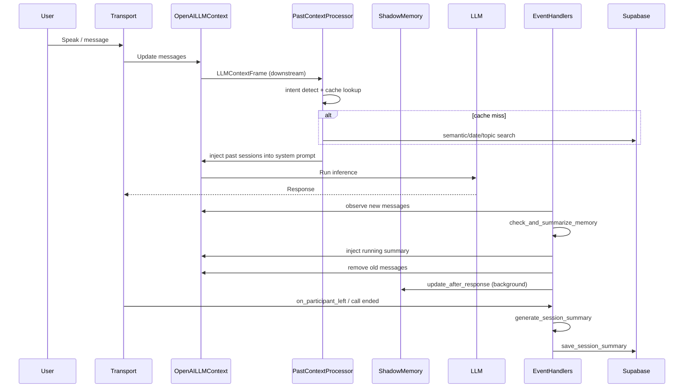

## Memory Layers Overview

This document summarizes how memory layers are used in the system: buffer sizes, rolling memory, and when data is written to the database. It also includes a sequence diagram.

### Short-term Buffer (LLM Context)
- Stored in `OpenAILLMContext` and updated each turn.
- Guardrail pruning keeps history within a token cap and preserves recent messages.
- Rolling summarization compresses older messages to maintain continuity.

Key settings in `backend/app/core/config.py`:
- `MEMORY_SUMMARIZATION_THRESHOLD` (default 50)
- `MEMORY_SUMMARY_FREQUENCY` (default 25)
- `MEMORY_KEEP_RECENT` (default 30)

Context Guard in `backend/bot/handlers/events.py`:
- Prunes if context exceeds limits and keeps the last 10 messages.

### Rolling Memory (Running Summary)
- Triggered when `MEMORY_SUMMARY_FREQUENCY` is reached after the threshold.
- Summarizes older messages, keeps the most recent `MEMORY_KEEP_RECENT`.
- Injects a "RUNNING CONVERSATION SUMMARY" system message and removes summarized messages.
- Stored in-memory only (not persisted).

### Shadow Memory (Background Cache)
- Asynchronously prewarms recent sessions and embeddings.
- Optionally injects past sessions into the initial system prompt.
- Updated after responses (background).

### Database Writes (Session Summary)
- Only written at session end (`on_participant_left` or call ended).
- Requires: duration >= 30s, at least 2 messages, and not already saved.
- Writes a session summary + topics to Supabase.

---

## Sequence Diagram

